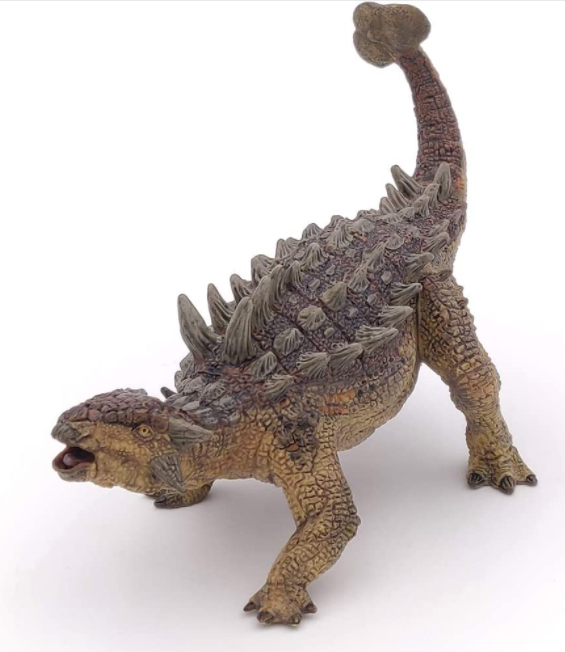
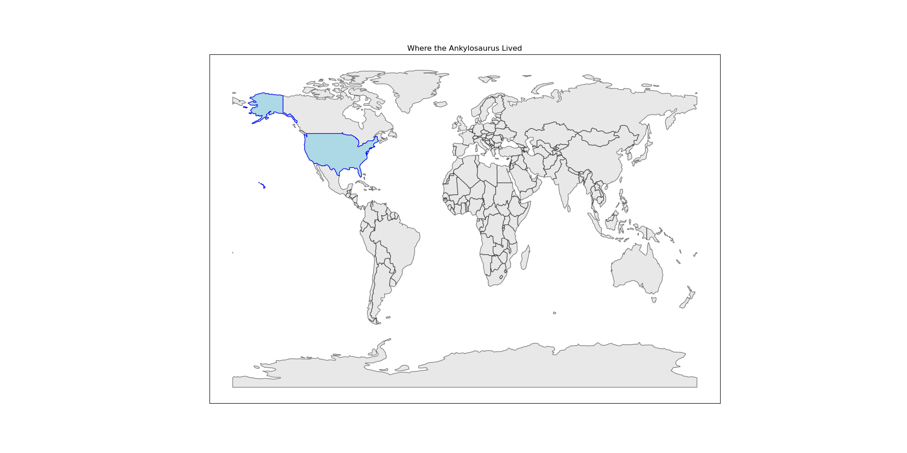
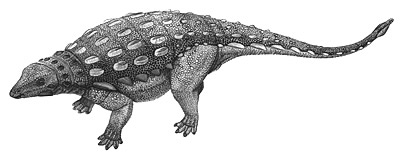
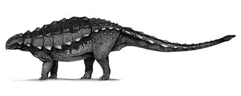

# you uploaded an Ankylosaurus.

    

The Ankylosaurus was 7 meters long. It was larger than 60.2% of the dinosaurs in our dataset.

<iframe src="assets/ank_length.html" width="500" height="500" frameborder="0"></iframe>

According the the National History Museum, he lived around here:

    

The Ankylosaurus was a herbivore, similar to about 57.9% of the dinosaurs in the Cretaceous Period.

<iframe src="assets/ank_diet.html" width="500" height="500" frameborder="0"></iframe>

The Ankylosaurus was never lonely. By taxonomy, it was closest to the

    

        
        
cedarpelta

    

    

        
        
gobisaurus

    

Press the back button, and test out another dinosaur!

Thanks for coming!
