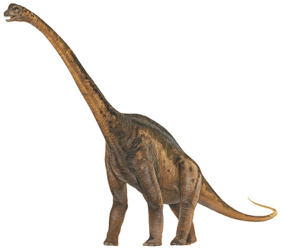
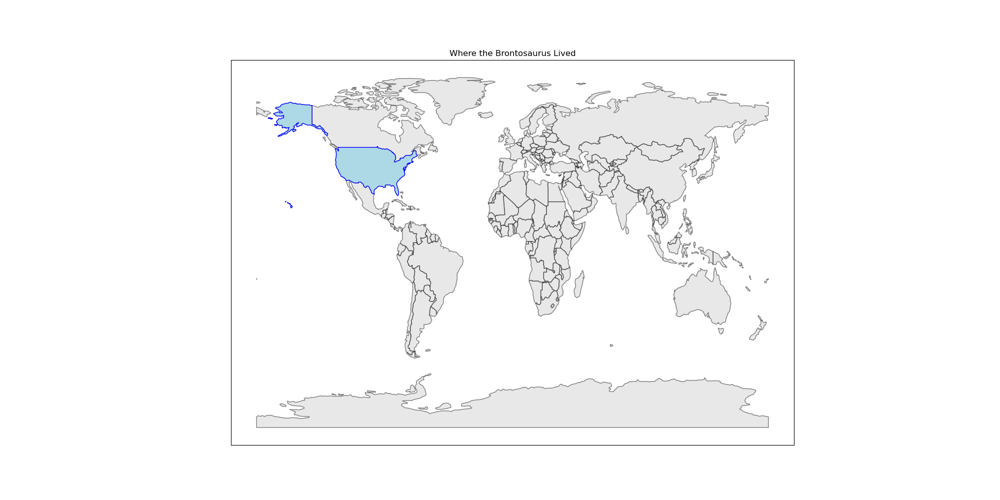
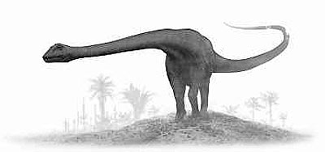
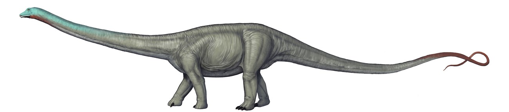

# you uploaded a Brontosaurus

    

The Brontosaurus was 21 meters long. It was larger than 94.2% of the dinosaurs in our dataset.

<iframe src="assets/bron_length.html" width="500" height="500" frameborder="0"></iframe>

According the the National History Museum, it lived around here:

    

The Brontosaurus was a herbivore, similar to about 62.3% of the dinosaurs in the Jurassic Period.

<iframe src="assets/bron_diet.html" width="500" height="500" frameborder="0"></iframe>

The Brontosaurus was never lonely. By taxonomy, it was closest to the

    

        
        
barosaurus

    

    

        
        
diplodocus

    

Press the back button, and test out another dinosaur!

Thanks for coming!
