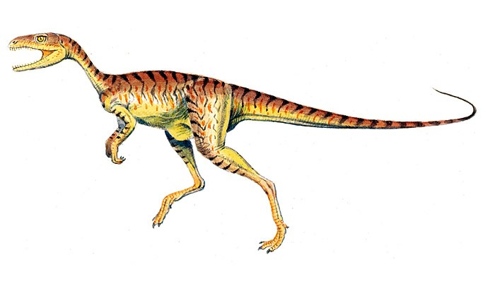

# you uploaded a Pterodactyl.

    

The Pterodactyl was 1.5 meters long. It was larger than 10.4% of the dinosaurs in our dataset.

<iframe src="assets/pter_length.html" width="500" height="500" frameborder="0"></iframe>

According the the National History Museum, it lived around here:

    

The Pterodactyl was a carnivore, similar to about 33.8% of the dinosaurs in the Jurassic Period.

<iframe src="assets/pter_diet.html" width="500" height="500" frameborder="0"></iframe>

The Ankylosaurus was never lonely. By taxonomy, it was closest to the

    

        
        
albertaceratops

    

    

        
        
chindesaurus

    

However note, the pterodactyl is not actually classified as a dinosaur! So it's closest relative may actually be something else altogether!

Press the back button, and test out another dinosaur!

Thanks for coming!
