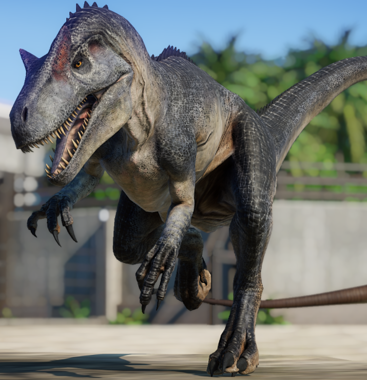
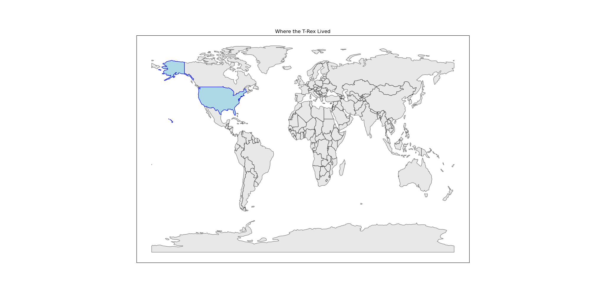
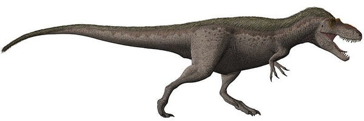
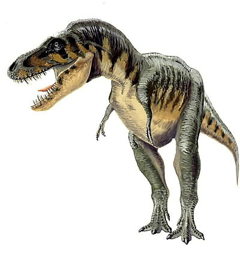

# you uploaded a Tyrannosaurus

    

The Tyrannosaurus was 12 meters long. It was larger than 81.5% of the dinosaurs in our dataset.

<iframe src="assets/trex_length.html" width="500" height="500" frameborder="0"></iframe>

According the the National History Museum, it lived around here:

    

The Tyrannosaurus was a carnivore, similar to about 29.8% of the dinosaurs in the Cretaceous Period.

<iframe src="assets/trex_diet.html" width="500" height="500" frameborder="0"></iframe>

The Tyrannosaurus was never lonely. By taxonomy, it was closest to the

    

        
        
daspletosaurus

    

    

        
        
tarbosaurus

    

Press the back button, and test out another dinosaur!

Thanks for coming!
