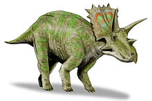

# you uploaded a Triceratops

    

The Triceratops was 9 meters long. It was larger than 69.1% of the dinosaurs in our dataset.

<iframe src="assets/tri_length.html" width="500" height="500" frameborder="0"></iframe>

According the the National History Museum, it lived around here:

    

The Triceratops was a herbivore, similar to about 57.9% of the dinosaurs in the Cretaceous Period.

<iframe src="assets/tri_diet.html" width="500" height="500" frameborder="0"></iframe>

The Triceratops was never lonely. By taxonomy, it was closest to the

    

        
        
anchiceratops

    

    

        
        
arrhinoceratops

    

Press the back button, and test out another dinosaur!

Thanks for coming!
